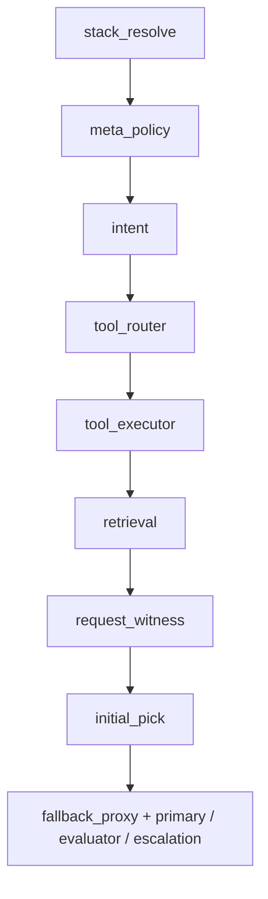

# Feature: Gateway chat routing pipeline

| Field | Value |
|-------|-------|
| **Doc kind** | `platform-contract` |
| **Areas** | Gateway chat path, routing, transforms, RAG, fallback, tool router, turn harness |
| **Status** | `current` (harness + pipeline shipped; **formal router plugin API** not yet) |
| **Introduced** | v0.1 routing + v0.1.1 tool router; assistant stacks v0.2+; turn harness v0.4+ |
| **Originated from** | [`plans/archive/virtual-models-operator.md`](../plans/archive/virtual-models-operator.md), [`plans/assistant-turn-harness.md`](../plans/assistant-turn-harness.md), [`plans/archive/context-window-admission.md`](../plans/archive/context-window-admission.md), [`docs/version-v0.1.1.md`](../version-v0.1.1.md) |
| **Related features** | [Operator assistants](operator-assistants.md), [Gateway RAG ingest and retrieval](gateway-rag-ingest-and-retrieval.md), [Context window admission](context-window-admission.md), [Operator provider model availability](operator-provider-model-availability.md) |
| **Depends on** | Assistant registry, broker upstream |
| **Last updated** | See git history |

## At a glance

Every `POST /v1/chat/completions` request that resolves to an **assistant** runs the **turn harness** (`internal/harness`): meta-policy, intent, optional tool router and workspace tool executor, per-assistant retrieval, routing policy + fallback loop, primary completion, then optional evaluator and escalation — all inside **one HTTP request**. Configuration lives on the [assistant routing stack](operator-assistants.md) (fallback chain, policy YAML, tool-router block, harness modules). Requests whose `model` is a direct upstream id skip the harness and proxy to chimera-broker unchanged.

**Wire contract for integrators:** [`configuration.md` — Chat completions client contract](../configuration.md#chat-completions-client-contract).

## Operator-visible behavior

- Clients send one **`model`** string (assistant id); the gateway picks upstream models and may retry without client involvement.
- IDE clients with large **tools** lists may see fewer tools forwarded on the **direct upstream** path when tool router is enabled (confidence threshold on settings card). On the assistant path, workspace tools are gateway-injected when `tool_executor` is enabled (client `tools` ignored).
- **RAG** snippets appear when retrieval runs (workspace/project/flavor scope); see [chat UI](operator-chat-ui.md).
- Settings **scoped logs** on an assistant card show routing resolution, harness stages, tool-router passes, fallback attempts, and limit skips.
- Header **`X-Chimera-Tool-Router: skip`** disables tool router for one request (debug/integration).

## System behavior and contracts

### Harness stage order (assistant path)

> **Generated index:** ordered stage names and log `module` ids are also listed in [`docs/generated/harness-stages.md`](../generated/harness-stages.md) (from `harness.DefaultRunner()` / `PrePrimaryRunner()`). See [Assistant harness internals](assistant-harness-internals.md).

Stages run in this order inside `handleAssistantChat` via `harness.DefaultRunner()` (after auth, merge, and assistant resolution in `handleV1Chat`):



| Stage | Purpose | Shipped implementation |
|-------|---------|------------------------|
| **stack_resolve** | Load fallback, policy, tool-router, harness module config | `harness.StackResolveStage` |
| **meta_policy** | Workspace sensitivity, cloud eligibility, file policy | `harness.MetaPolicyStage` |
| **intent** | Heuristic / optional LLM intent signals | `harness.IntentStage` |
| **tool_router** | Slim client `tools` when module enabled | `transform.ApplyToolRouter` via `ToolRouterStage` |
| **tool_executor** | Gateway workspace read/write/list/search rounds | `harness.ToolExecutorStage` |
| **retrieval** | Per-assistant top_k, floors, compression | `harness.RetrievalStage` + `rag.Service` |
| **request_witness** | Operator-safe request summary logs | `harness.RequestWitnessStage` |
| **initial_pick** | Choose first upstream id in chain walk | `virtualmodel.PickInitialModelWithAvailability` → `routing.InMemoryPolicy` |
| **fallback_proxy** | Attempt loop, primary, evaluator, escalation | `harness.FallbackProxyStage` + `chat.WithVirtualModelFallback` |

Module toggles on the assistant card can disable stages (e.g. retrieval off → no inject even when global RAG is on). See [operator assistants](operator-assistants.md).

**Invariants**

- **Fail-open tool router** — On disable, misconfig, parse failure, or empty keep-set, the full `tools` array is passed upstream unchanged (when the tool-router stage runs).
- **Fallback chain required** — Assistants without a non-empty chain fail at compile/load time; chat returns 503 if no initial model resolves.
- **Initial index** — Loop starts at the picked model’s index in the chain (`routing.StartingFallbackIndex`), not always index 0.
- **Skip unavailable** — Operator-marked unavailable models are skipped with `routing.model.unavailable_skipped` (no upstream call).
- **Admission before call** — TPM/RPM and context-window checks can skip a candidate before proxy (see [context window admission](context-window-admission.md)).
- **Retriable errors** — 429, 5xx, 413, context overflow, and rate-limit signals advance to the next chain entry when one exists.
- **Non-retriable** — Some 400 classes (e.g. model not found) stop the walk.
- **Retrieval placement** — After tool router / tool executor, before initial pick; **per-assistant** knobs when the retrieval module is enabled; global `rag.enabled` still gates whether retrieval can run at all.
- **Client model unchanged** — Body may still show assistant id; each attempt sets upstream id in proxied payload.
- **Turn envelope** — Completed turns persist redacted `harness_summary_json` and may set `X-Chimera-Harness-Summary` on the HTTP response.

**Routing policy (initial pick)**

- YAML rules: `when.min_message_chars` on last user message; first match wins.
- Outcomes: `ViaRule`, `ViaAmbiguousDefault`, `ViaChainOnly` (`internal/routing`).
- Disabled or invalid policy YAML → chain-only (first **available** entry).
- Evaluate API: `POST /api/ui/assistants/{id}/routing/evaluate` (routing dry-run). Harness dry-run: `POST /api/ui/assistants/{id}/harness/evaluate` (pre-primary stages only).

**Tool router (body transform)**

- Router models tried in order; first successful JSON score list wins.
- Each tool gets confidence 0–1; keep tools `>= threshold` (default 0.5, overridable per assistant or `X-Chimera-Tool-Confidence-Threshold`).
- Missing score for a tool → **keep** (conservative).
- Zero tools pass threshold → fail-open to full list.

**Fallback loop**

- Records failures for wrap-up message when chain exhausted.
- HTTP 413 from a model id excludes that id from later attempts in the same request.
- Streams and non-streams share the same retry semantics where applicable; evaluator `stream_policy` may buffer or gate SSE (see [configuration.md](../configuration.md#streaming)).

### Target extensibility (design direction — not fully shipped)

Future work should treat the pipeline as a **composable router stack**, not only sequential harness stages. Intended direction:

| Router kind | Responsibility | Config home (today) | Plugin status |
|-------------|----------------|----------------------|---------------|
| **Transform** | Mutate request body (tools, messages, params) | Assistant tool-router block | One impl (`transform`); **no registry** |
| **Retrieval** | Augment context (vector, manifest, web, …) | Global RAG gate + per-assistant retrieval module | Harness `RetrievalStage`; **no shared Router interface** |
| **Policy** | Pick initial upstream + rule metadata | Assistant routing policy YAML | `InMemoryPolicy`; **no shared Router interface** |
| **Admission** | Skip candidates pre-flight | Limits YAML + availability SQLite | `providerlimits.Guard`; extend via new checkers |
| **Fallback** | Attempt loop + retry classification | Assistant fallback chain | `chat.WithVirtualModelFallback`; extend retry rules carefully |

**Planned integration rules (for implementers)**

1. New routers implement a small **stage contract**: input/output = proxied chat JSON + turn context (tenant, assistant id, conversation id, scope coords, catalog snapshot).
2. Stages register in **explicit order**; assistant stack references which modules are enabled.
3. **Observability** — Each stage emits stable `msg` slugs and `assistant_id` (legacy logs may still use `virtual_model_id`).
4. **Fail-safe defaults** — Transforms and retrieval stages default to **no-op on error** unless explicitly configured otherwise.
5. **Do not bypass admission** — New stages must not call upstream directly; final hop stays in `chat` proxy + fallback loop.

Until a registry lands, add stages by extending `harness` stage lists and document the new stage here.

## Interfaces

| Surface | Detail |
|---------|--------|
| Chat entry | `POST /v1/chat/completions` — Bearer auth |
| Assistant resolution | `body.model` → assistant registry (`virtualmodel` package) |
| Tool router skip | Header `X-Chimera-Tool-Router: skip` |
| Tool threshold override | Header `X-Chimera-Tool-Confidence-Threshold` |
| RAG / policy scope | Headers `X-Chimera-Project`, `X-Chimera-Flavor-Id` |
| History metadata | Header `X-Chimera-Workspace-Id` (conversation snapshot; not primary policy scope) |
| Response metadata | `X-Chimera-Upstream-Model`, `X-Chimera-RAG-Hits`, `X-Chimera-Conversation-Id`, optional `X-Chimera-Harness-Summary` |
| Settings APIs | Assistant fallback, policy, tool-router, harness modules, evaluate — see [operator assistants](operator-assistants.md) |
| Direct upstream | `body.model` = `provider/model` → `chat.ProxyChatCompletion` (no harness) |

Full header tables: [`configuration.md`](../configuration.md#chat-completions-client-contract).

## Code map

| Concern | Location |
|---------|----------|
| Chat HTTP entry | `internal/server/server.go` — `handleV1Chat` |
| Assistant harness orchestration | `internal/server/assistant_chat.go` — `handleAssistantChat` |
| Harness stages | `internal/harness/stages.go`, `runner.go` — `DefaultRunner` |
| Tool router transform | `internal/transform/toolrouter.go` |
| RAG inject | `internal/harness` retrieval stage + `internal/rag/` |
| Policy compile | `internal/routing/inmemory.go`, `internal/routing/routing.go` |
| Assistant registry | `internal/virtualmodel/registry.go` |
| Fallback loop | `internal/chat/chat.go` — `WithVirtualModelFallback`, `shouldRetryVirtualModelFallback` |
| Admission | `internal/providerlimits/`, wired via `Runtime.LimitsGuard()` |
| Harness summary header | `internal/harness/header.go` |
| Proxy hooks | `internal/chat/chat.go` — `ProxyOpts` |
| Generate/evaluate | `internal/routinggen/`, admin UI assistant handlers |

## Verification

```bash
go test ./chimera/chimera-gateway/internal/harness/...
go test ./chimera/chimera-gateway/internal/chat/... -run VirtualModelFallback
go test ./chimera/chimera-gateway/internal/transform/...
go test ./chimera/chimera-gateway/internal/virtualmodel/...
go test ./chimera/chimera-gateway/internal/routing/...
go test ./chimera/chimera-gateway/internal/server/ -run RAG
```

Manual: configure assistant with short-context + long-context models in fallback; send large prompt; confirm skip/retry and `harness.stage.*` lines in `/ui/settings` and successful delivery from later chain entry.

## Out of scope and known gaps

- **Formal `ChatRouter` plugin registry** — not implemented; pipeline is sequential harness stages.
- **LLM-generated routing policy** — exploration only ([`docs/version-v0.1.md`](../version-v0.1.md)).
- **Additional transform stages** (prompt compression, tool format normalizers) — add via future Transform router slot.
- **Shared routing-rule catalog** across assistants — policy YAML is per-assistant today.

## References

- Assistant config: [`operator-assistants.md`](operator-assistants.md)
- Client wire contract: [`configuration.md`](../configuration.md#chat-completions-client-contract)
- Tool router plan: [`docs/version-v0.1.1.md`](../version-v0.1.1.md)
- Context admission: [`context-window-admission.md`](context-window-admission.md)
- Harness delivery: [`assistant-turn-harness.md`](../plans/assistant-turn-harness.md)
