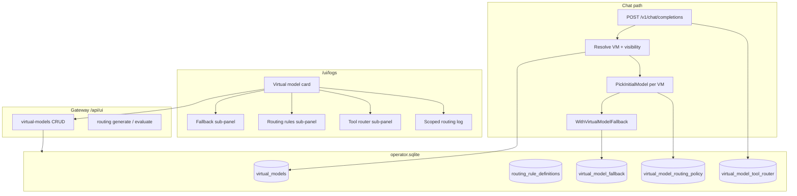

# Plan: Operator-managed virtual models

| Field | Value |
|-------|-------|
| **Doc kind** | `feature-plan` |
| **Owners / areas** | Gateway runtime, operator SQLite, `/ui/logs` embed UI, routing, metrics, operator docs |
| **Status** | `done` |
| **Targets** | Gateway next minor after unified operator cards baseline |
| **Last updated** | 2026-05-18 |
| **Supersedes / superseded by** | Extends [`unified-logs-operator-shell.md`](unified-logs-operator-shell.md); replaces global single-VM routing described in [`configuration.md`](../configuration.md) |

## At a glance

Today the gateway exposes exactly one virtual model id (`Chimera-<semver>`), hard-coded from `gateway.semver`, and all routing — fallback chain, routing-policy rules, and tool-router settings — is global in `gateway.yaml` and a single `routing-policy.yaml`. Operators should instead create **virtual models** from `/ui/logs` (like users and indexer workspaces): each model has its own identity, visibility, on/off switch, and routing stack. Routing rules become reusable definitions in the operator database; each virtual model attaches fallback (required), optional routing rules, and optional tool-router blocks with per-block toggles. Cards in the logs UI show configuration, usage, and scoped routing-decision streams.

| Phase | Outcome | Status |
|-------|---------|--------|
| [Phase 1 — Data model and routing catalog](#phase-1--data-model-and-routing-catalog) | Virtual models and routing-rule definitions persist in operator SQLite; bootstrap imports the legacy `Chimera-<semver>` stack | `done` |
| [Phase 2 — Gateway runtime resolution](#phase-2--gateway-runtime-resolution) | Chat and `GET /v1/models` resolve per-virtual-model routing; logs carry `virtual_model_id` | `done` |
| [Phase 3 — Operator HTTP API](#phase-3--operator-http-api) | Session-authenticated CRUD for virtual models and their routing attachments | `done` |
| [Phase 4 — Logs UI cards and workflows](#phase-4--logs-ui-cards-and-workflows) | Operators create, edit, enable, and inspect virtual models from `/ui/logs` | `done` |
| [Phase 5 — Observability and migration](#phase-5--observability-and-migration) | Per-model usage metrics, scoped log panels, YAML deprecation path | `done` |

---

## Background

### Current state (single hard-coded virtual model)

| Concern | Today | Location |
|---------|-------|----------|
| **Virtual model id** | `"Chimera-" + gateway.semver` (e.g. `Chimera-0.2.0`) | [`chimera/internal/config/config.go`](../../chimera/internal/config/config.go) → `Resolved.VirtualModelID` |
| **Model listing** | One synthetic entry prepended to broker catalog | [`chimera-gateway/internal/server/server.go`](../../chimera/chimera-gateway/internal/server/server.go) `handleV1Models` |
| **Chat routing** | If `body.model == VirtualModelID` → RAG (when enabled) → `Policy.PickInitialModel` → `WithVirtualModelFallback` | [`server.go`](../../chimera/chimera-gateway/internal/server/server.go), [`internal/routing/routing.go`](../../chimera/chimera-gateway/internal/routing/routing.go) |
| **Fallback chain** | Global ordered list | `gateway.yaml` → `routing.fallback_chain` |
| **Routing rules** | Global YAML file | `paths.routing_policy` → `routing-policy.yaml` (`ambiguous_default_model`, ordered `rules[]`) |
| **Tool router** | Global | `gateway.yaml` → `routing.router_models`, `routing.tool_router.{enabled, confidence_threshold}` |
| **Operator UI** | Three global cards: Routing rules, Fallback chain, Router model | [`adminRouting.js`](../../chimera/chimera-gateway/internal/server/adminui/embed/embedui/logs/render/cards/adminRouting.js), [`adminFallback.js`](../../chimera/chimera-gateway/internal/server/adminui/embed/embedui/logs/render/cards/adminFallback.js), [`adminRouterModels.js`](../../chimera/chimera-gateway/internal/server/adminui/embed/embedui/logs/render/cards/adminRouterModels.js) |
| **State API** | Single `virtual_model_id` in `GET /api/ui/state` | [`internal/operatorapi/state.go`](../../internal/operatorapi/state.go) |

Routing policy evaluation is well-defined: first matching rule by `when.min_message_chars` on the last user turn wins; else `ambiguous_default_model`; else first entry in fallback chain. Structured logs already emit routing decisions (`routing.rule.matched`, `chat.routing.resolved`, `conversation.routing.resolved`, fallback attempts). The admin cards surface 24h model-usage counts and scoped evlog panels — but all scoped to the **one** global virtual model.

### Product intent

Each **virtual model** is a first-class operator object:

| Field | Default | Notes |
|-------|---------|-------|
| **name** | — | Human label; with version forms the client-facing model id |
| **version** | — | Semver or opaque string; combined with name for OpenAI `model` field |
| **description** | empty | Shown in UI and optionally in `GET /v1/models` metadata |
| **enabled** | `true` | Disabled models hidden from catalog and rejected on chat |
| **visibility** | `public` | `public` → any authenticated user; `private` → creator only |
| **persistence** | operator SQLite | Same store family as indexer workspaces ([`indexer-workspaces-sqlite-gateway-api.md`](indexer-workspaces-sqlite-gateway-api.md)) |

Each virtual model owns a **routing stack**:

| Block | Required | Toggleable | Parameters (parity with today) |
|-------|----------|------------|--------------------------------|
| **Fallback chain** | yes | no (always on) | Ordered upstream model ids; free-tier filter applies at generate time |
| **Routing rules** | no | yes | Policy YAML body (`ambiguous_default_model`, `rules[]`) or normalized rule bindings |
| **Tool router** | no | yes | `router_models[]`, `tool_router.enabled`, `confidence_threshold` |
| **Future routers** | no | yes | Placeholder rows / feature flags only in v1 |

**Routing rule definitions** (shared catalog, not per-VM duplicates of logic):

| Field | Purpose |
|-------|---------|
| **name** | Operator label (e.g. `long-user-turn`) |
| **routing.slug** | Stable key for logs, metrics, and UI (e.g. `routing.rule.long_user_turn`) — aligns with [`operator-message-registry.md`](operator-message-registry.md) direction |
| **default configuration** | Default `when` + `models` fragment; VM attachment may override |

Virtual model cards in `/ui/logs` let operators add/remove/enable/disable rule attachments, edit fallback and tool-router blocks, dry-run policy evaluation, and read scoped logs showing how rules fired.

### Constraints

- Reuse **operator SQLite** (`operator.sqlite_path`); add migrations under `migrations/chimera-gateway/operator/` — do not mix with metrics DB.
- Follow existing **session-authenticated** `/api/ui/*` patterns (tokens, workspaces, routing handlers).
- Preserve **Continue / IDE** compatibility: clients still send a single `model` string on `POST /v1/chat/completions`; multi-VM is a richer catalog, not a protocol change.
- **RAG** stays gateway-global for v1 unless explicitly scoped in a follow-up (see Open questions).

**Related docs:** [`configuration.md`](../configuration.md), [`unified-logs-operator-shell.md`](unified-logs-operator-shell.md), [`log-conversations.md`](log-conversations.md), [`version-v0.1.1.md`](../version-v0.1.1.md) (tool-router, fallback).

---

## Phase 1 — Data model and routing catalog

**Goal.** Operator SQLite holds virtual models, a routing-rule definition catalog, and per-model routing attachments; first gateway start imports the legacy global config into one bootstrap virtual model.

**Deliverables**

- Migration `000002_virtual_models.sql` (number illustrative) with tables:
  - **`virtual_models`** — `id`, `model_id` (unique client id, e.g. `Chimera-0.2.0` or `acme-research/1.0.0`), `name`, `version`, `description`, `enabled`, `visibility` (`public`|`private`), `created_by_principal_id`, `tenant_id`, timestamps.
  - **`routing_rule_definitions`** — `id`, `name`, `slug` (unique), `default_config_json` (or YAML blob: `when`, `models`), `description`, timestamps.
  - **`virtual_model_fallback`** — `virtual_model_id` FK, `chain_json` (ordered model ids), `updated_at`. One row per VM (required).
  - **`virtual_model_routing_policy`** — `virtual_model_id` FK, `enabled`, `policy_yaml` (full document for v1; normalized bindings later), `updated_at`.
  - **`virtual_model_tool_router`** — `virtual_model_id` FK, `enabled`, `router_models_json`, `confidence_threshold`, `updated_at`.
  - **`virtual_model_rule_bindings`** (optional v1 if policy stays monolithic YAML) — `virtual_model_id`, `routing_rule_definition_id`, `enabled`, `override_config_json`, sort order.
- Repository methods in [`internal/operatorstore`](../../chimera/chimera-gateway/internal/operatorstore) (or sibling package) with tests mirroring workspace CRUD discipline.
- **Bootstrap importer** on gateway startup (once per empty DB):
  - Read current `Resolved`: `VirtualModelID`, `FallbackChain`, on-disk `routing-policy.yaml`, `RouterModels`, `ToolRouterEnabled`, `ToolRouterConfidenceThreshold`.
  - Insert one **public, enabled** virtual model row matching legacy id.
  - Seed routing-rule definitions from existing `rules[].name` in policy YAML (slug derived from name).
- Seed catalog entries for built-in rule shapes at minimum: `default` (empty `when`), `long-user-turn` (`min_message_chars`).

**Acceptance**

- Fresh operator DB + existing `gateway.yaml` / `routing-policy.yaml` → one virtual model row with equivalent routing after import.
- Unit tests: CRUD round-trip, unique `model_id`, FK cascade on delete.

**Status:** `done`

---

## Phase 2 — Gateway runtime resolution

**Goal.** Requests that name a virtual model id resolve routing from SQLite (with in-memory cache + revision), not from global YAML alone.

**Deliverables**

- **`VirtualModelStore`** (name illustrative): load enabled models, compile per-VM `routing.Policy` equivalent from DB policy YAML, expose fallback chain and tool-router settings.
- **Cache invalidation:** bump revision on any operator API write; optional short TTL; startup load from DB.
- **`POST /v1/chat/completions`:**
  - Resolve `body.model` against virtual model registry (not only `Resolved.VirtualModelID`).
  - Enforce `enabled` and visibility (map bearer token → `principal_id` / tenant; private models visible only to creator).
  - Use **that VM's** fallback chain and policy for `PickInitialModel` / `WithVirtualModelFallback`.
  - Apply tool-router transformer only when **that VM's** tool-router block is enabled and non-empty.
  - Emit structured field **`virtual_model_id`** on routing and conversation log lines (alongside existing `upstreamModel`, `rule`, etc.).
- **`GET /v1/models`:** prepend all **enabled public** virtual models plus **private** models for the authenticated principal; set `owned_by: "chimera"` (or include `description` when present).
- **`GET /api/ui/state`:** extend `GatewayState` with `virtual_models[]` summary list; keep `virtual_model_id` as **default / bootstrap** id for backward-compatible overview card until UI switches.
- **Compatibility shim (transition):** if `body.model == legacy VirtualModelID` and no DB row yet, fall back to file-based config (same as today) until bootstrap runs.

**Acceptance**

- Integration test: two virtual models with different fallback chains → same user message routes to different initial upstream models.
- Disabled or private foreign model → `404` / `403` on chat; omitted from catalog for other users.
- Existing single-VM deployments behave unchanged after bootstrap import.

**Status:** `done`

---

## Phase 3 — Operator HTTP API

**Goal.** Session-authenticated endpoints mirror workspace/token CRUD; routing generate/evaluate become per-virtual-model.

**Deliverables**

- Routes under `/api/ui/virtual-models` (exact prefix finalized in PR):
  - `GET /` — list (respect session principal for private rows).
  - `POST /` — create draft VM (name, version, description, visibility); server assigns stable `model_id` (see Open questions).
  - `GET /{id}`, `PUT /{id}`, `DELETE /{id}` — metadata + enabled toggle.
  - `PUT /{id}/fallback` — save chain (validate non-empty ids).
  - `PUT /{id}/routing-policy` — save YAML; validate via `routing.ValidatePolicyYAML`.
  - `PUT /{id}/tool-router` — save router models + enabled + threshold.
  - `POST /{id}/routing/generate` — port of [`computeRoutingDraft`](../../chimera/chimera-gateway/internal/server/adminui/api/routing/handlers.go) scoped to VM (writes VM row, not global YAML).
  - `POST /{id}/routing/evaluate` — port of dry-run evaluate with VM id + VM fallback chain.
- **`/api/ui/routing/*` global handlers:** deprecate writes to `gateway.yaml` / `routing-policy.yaml` (read-only or redirect to default VM) after Phase 4 UI lands.
- **`routing_rule_definitions` CRUD** (operator-only): list/create/update for catalog entries used when attaching rules to a VM.
- OpenAPI-shaped types in [`internal/operatorapi`](../../internal/operatorapi) (`VirtualModelSummary`, `VirtualModelDetail`, …).

**Acceptance**

- curl / handler tests for create → configure fallback → evaluate → chat smoke against VM id.
- Invalid policy YAML rejected before persist; broker catalog validation on generate matches current routing handlers.

**Status:** `done`

---

## Phase 4 — Logs UI cards and workflows

**Goal.** `/ui/logs` gains a **Virtual models** section; each model is a collapsible card with nested routing controls, matching users/workspaces interaction patterns.

**Deliverables**

- **Section layout** (after Overview, before or replacing global Routing section):
  - Intro blurb + **Add virtual model** → draft card ([`workspaceDraft.js`](../../chimera/chimera-gateway/internal/server/adminui/embed/embedui/logs/render/cards/workspaceDraft.js) pattern).
  - One **persisted card per VM**: collapsed chips for enabled/disabled, visibility, rule count, fallback depth, tool-router on/off.
- **Expanded card body:**
  - Metadata form: name, version, description, enabled toggle, public/private.
  - **Fallback chain** sub-panel — reuse [`adminFallback.js`](../../chimera/chimera-gateway/internal/server/adminui/embed/embedui/logs/render/cards/adminFallback.js) table/YAML/edit flow wired to `/api/ui/virtual-models/{id}/fallback`.
  - **Routing rules** sub-panel — reuse [`adminRouting.js`](../../chimera/chimera-gateway/internal/server/adminui/embed/embedui/logs/render/cards/adminRouting.js); master toggle for optional policy block; attach/detach catalog rules when bindings table exists; generate / dry-run scoped to VM.
  - **Tool router** sub-panel — reuse [`adminRouterModels.js`](../../chimera/chimera-gateway/internal/server/adminui/embed/embedui/logs/render/cards/adminRouterModels.js) with VM-scoped save.
  - **Usage table** — 24h hits per upstream model for this VM (extend metrics query or log-derived counts filtered by `virtual_model_id`).
  - **Scoped log panel** — filter evlog to routing slugs where `virtual_model_id` matches (fallback, rule match, tool-router, `conversation.routing.resolved`).
- **Overview card** ([`gatewayOverview.js`](../../chimera/chimera-gateway/internal/server/adminui/embed/embedui/logs/render/cards/gatewayOverview.js)): show count of enabled virtual models + link/scroll to section; optionally retain bootstrap id as “default model”.
- Retire or collapse legacy **global** Routing / Fallback / Router model cards once at least one VM exists in DB (feature flag or always-on after migration).

**Acceptance**

- Operator can create a second virtual model, configure distinct fallback, complete a chat in Continue using new `model` id, and see routing lines in that VM's scoped panel.
- Goja component tests for card HTML + action wiring (mirror [`logs_components_test.go`](../../chimera/chimera-gateway/internal/server/adminui/embed/embedui_test/logs_components_test.go)).

**Status:** `done`

---

## Phase 5 — Observability and migration

**Goal.** Metrics and logs consistently attribute traffic to a virtual model; file-based global routing becomes optional legacy.

**Deliverables**

- **Log emission:** ensure all routing-related slog calls include `virtual_model_id`; add registry slugs for new operator actions (`gateway.virtual_model.created`, `.updated`, `.deleted`).
- **Metrics:** extend gateway metrics schema (or labels) with `virtual_model_id` on chat outcome rows; UI aggregates per VM on cards.
- **Log UI derive:** update [`conversationCardModel.js`](../../chimera/chimera-gateway/internal/server/adminui/embed/embedui/logs/derive/conversationCardModel.js), [`adminScopedEventsForRouting`](../../chimera/chimera-gateway/internal/server/adminui/embed/embedui/logs_app.js) filters to accept VM scope parameter.
- **Migration doc** in [`configuration.md`](../configuration.md):
  - `gateway.semver` still drives gateway version string but **no longer** defines the only virtual model id once DB is populated.
  - `routing.fallback_chain`, `paths.routing_policy`, and global tool-router keys marked **deprecated** (read for bootstrap import only).
- Optional **export/import:** download VM as YAML bundle for gitops; out of scope unless needed for v1 ship.
- Remove dual-write to `gateway.yaml` from generate handlers after one release with bootstrap.

**Acceptance**

- Fixture log comparison: routing lines include `virtual_model_id`; scoped panels exclude other VMs' traffic.
- Documented upgrade path: existing installs auto-import legacy config; no manual YAML edit required.

**Status:** `done`

---

## Target architecture (reference)

---

## Open questions

1. **`model_id` format:** `{name}/{version}`, `Chimera-{version}`, or operator-supplied slug with validation? Must stay OpenAI-compatible (no spaces).
2. **Default model:** Does one VM remain marked `is_default` for overview / Continue docs, or is “lowest id / first created” implicit?
3. **Private visibility:** Scope by **creator principal** (token tenant) only, or support shared private within tenant?
4. **RAG:** Global (all virtual models get retrieval) vs per-VM `rag_enabled` flag — v1 recommendation: global, document extension point.
5. **Routing rules storage:** v1 monolithic `policy_yaml` per VM (fastest parity) vs normalized bindings to `routing_rule_definitions` — plan supports both; pick one for first PR.
6. **Global YAML sunset:** Hard cut after bootstrap vs indefinite read-only mirror for gitops users?
7. **Future routers:** Schema placeholder (`virtual_model_routers` with `kind`, `enabled`, `config_json`) in Phase 1 to avoid another migration?

---

## References

- Config resolution: [`chimera/internal/config/config.go`](../../chimera/internal/config/config.go) (`VirtualModelID`, `FallbackChain`, `RouterModels`)
- Chat path: [`chimera-gateway/internal/server/server.go`](../../chimera/chimera-gateway/internal/server/server.go) (`handleV1Chat`, `handleV1Models`)
- Routing engine: [`chimera-gateway/internal/routing/routing.go`](../../chimera/chimera-gateway/internal/routing/routing.go)
- Policy generation: [`chimera-gateway/internal/routinggen/generate.go`](../../chimera/chimera-gateway/internal/routinggen/generate.go)
- Operator routing API: [`adminui/api/routing/handlers.go`](../../chimera/chimera-gateway/internal/server/adminui/api/routing/handlers.go)
- Operator SQLite / workspaces pattern: [`internal/operatorstore/store.go`](../../chimera/chimera-gateway/internal/operatorstore/store.go), [`indexer-workspaces-sqlite-gateway-api.md`](indexer-workspaces-sqlite-gateway-api.md)
- UI cards: [`adminRouting.js`](../../chimera/chimera-gateway/internal/server/adminui/embed/embedui/logs/render/cards/adminRouting.js), [`adminFallback.js`](../../chimera/chimera-gateway/internal/server/adminui/embed/embedui/logs/render/cards/adminFallback.js), [`adminRouterModels.js`](../../chimera/chimera-gateway/internal/server/adminui/embed/embedui/logs/render/cards/adminRouterModels.js)
- Example config: [`config/gateway.example.yaml`](../../config/gateway.example.yaml), [`config/routing-policy.yaml`](../../config/routing-policy.yaml)
- Routing log slugs: [`docs/plans/log-gateway.md`](log-gateway.md), [`internal/operatorcopy/messages.yaml`](../../internal/operatorcopy/messages.yaml)
